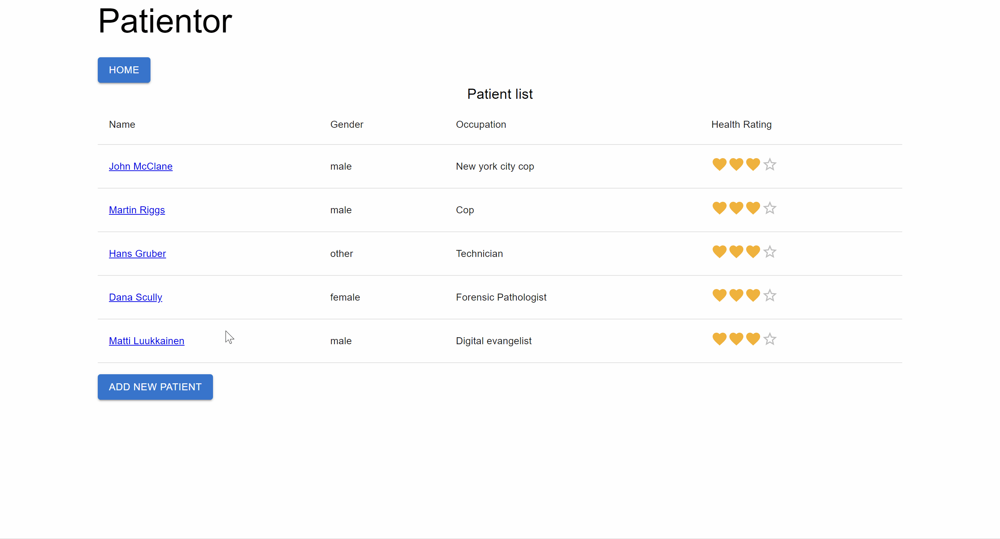

# Patientor

Patientor is a medical record application for doctors who handle diagnoses and basic health information of their patients.

This is one of the projects in the [Full Stack Open](https://fullstackopen.com/en/) online course.

For more projects related to Full Stack Open, please visit the [fullstackopen](https://github.com/wengcychan/fullstackopen.git) repository.

## 🎥 Demo

🌐 [Live Demo](https://fullstackopen-patientor.onrender.com) : Patientor's Website

## 📸 Screenshots

## 🛠️ Technologies Used

- React
- TypeScript
- Nodejs
- Material UI
